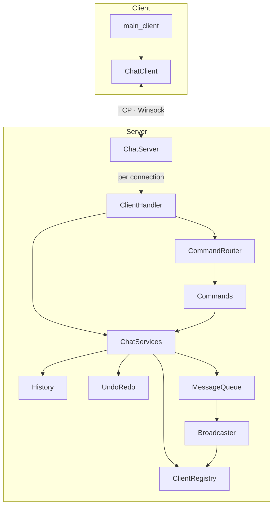
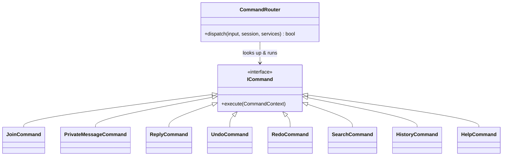
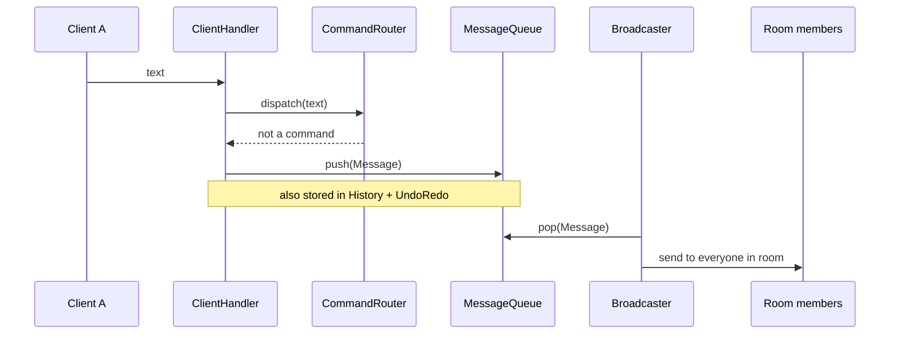

# Chat Application in C++ (Winsock)

A real-time, multi-room chat server and client written in modern C++ with Winsock and threads.
Supports rooms, private messaging, undo/redo, history, and keyword search.

---

## Features

- **Multi-room chat** — join or create rooms on the fly
- **Private messaging** — direct messages between users
- **Undo / redo** — take back your last message and replay it
- **History & search** — view past messages or find them by keyword
- **Multithreaded** — one thread per client plus a broadcast worker

---

## Architecture

The server is split into small, single-responsibility units. `ChatServer` owns the shared
services and hands each connection to a `ClientHandler`, which routes input through the
`CommandRouter`. Chat messages flow through a `MessageQueue` that a background `Broadcaster`
drains and fans out to the room.



---

## Design Patterns

| Pattern | Where | Why |
| --- | --- | --- |
| **Command** | `ICommand`, `Commands.*`, `CommandRouter` | Each `/command` is its own class; the router maps a name to a handler. No giant `if/else`. |
| **Dependency Injection** | `ChatServices` | Shared services are passed by reference instead of using globals, so nothing hides its dependencies. |
| **Producer–Consumer** | `MessageQueue` + `Broadcaster` | Handlers produce messages; one worker consumes and broadcasts, decoupling send from receive. |
| **Facade** | `ChatServer` | A single object wires up and owns every service and the accept loop. |
| **RAII** | `ChatServer`, `ChatClient` | Constructors acquire Winsock/threads; destructors release them. |

### Command pattern

Adding a command is one class plus one line in the router.



### Data structures

Each storage class wraps one classic structure behind a thread-safe API:

- `MessageQueue` — **queue** for pending broadcasts
- `History` — **doubly linked list**, capped at a max size
- `UndoRedo` — **two stacks** (undo / redo)

---

## Message Flow

A plain chat message never blocks the sender: it is queued and delivered by the broadcaster.



---

## Project Structure

```text
server/
  Platform.h          Winsock includes
  Utils.*             time, formatting, socket send, parsing
  Message.*           message model
  MessageQueue.*      thread-safe broadcast queue
  History.*           linked-list message history
  UndoRedo.*          undo/redo stacks
  ClientRegistry.*    clients + rooms state
  ChatServices.h      shared-services bundle (DI)
  Broadcaster.*       background broadcast worker
  Command.h           ICommand + context
  Commands.*          concrete commands
  CommandRouter.*     input → command
  ClientHandler.*     per-connection loop
  ChatServer.*        socket setup + accept loop
  main_server.cpp     entry point
client/
  ChatClient.*        connection, send/receive
  main_client.cpp     entry point + UI
build.bat             MSVC build script
```

---

## Build & Run

Requires Windows, C++17, and the Winsock2 library.

```bat
build.bat
```

This produces `main_server.exe` and `main_client.exe`. Start the server first, then run one
client per user.

---

## Commands

```text
/join <room>           Join or create a chat room
/pm <user> <message>   Send a private message
/reply <user> <msg>    Reply to a user in the current room
/undo                  Undo your last message
/redo                  Redo your last undone message
/history               Show message history
/search <keyword>      Search messages by keyword
/quit                  Exit
/help                  Show this help
```
